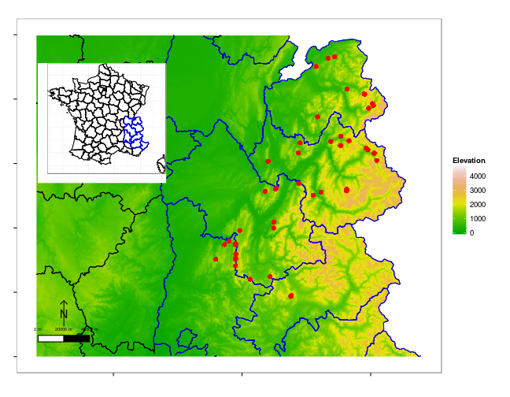
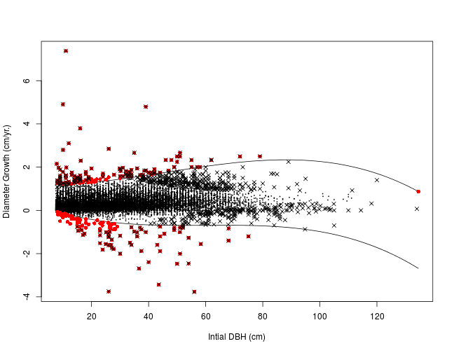
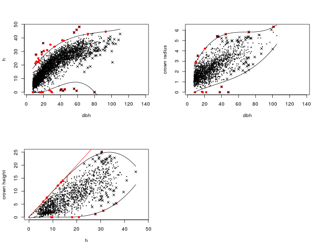

# *Ecological Archives* Exxxxx
# Fuhr M. *et al* Long-term stem inventory data from mountain forest plots in France. *Ecology* xxxx

## INTRODUCTION

TODO (Zianis, Muukkonen, Mäkipää, and Mencuccini, 2005).

 
**Figure 1** Plots distribution in France.

 [github](https://github.com/dfalster/baad/).

## METHODS

## METADATA CLASS I. DATA SET DESCRIPTORS

### A. DATA SET IDENTITY
Long-term stem inventory data from mountain forest plots in France.

### B. DATA SET IDENTIFICATION CODE:

### C. DATA SET DESCRIPTORS:
**1. Originators**: The study was initiated by TODO.

**2. Abstract**: We present repeated stem measurement data from 0 plots in mountain forests in France.

### D. Key words

France; mortality; permanent plot; mountain forest; recruitment; stem growth; stem height; canopy radius and height; forest management

## METADATA CLASS II. RESEARCH ORIGIN DESCRIPTORS

### A. "OVERALL" PROJECT DESCRIPTION

**1. Identity**: 

**2. Originators**: 

**3. Period of study**: From 1994 to 2015.

**4. Objectives**:

**5. Abstract**:

**6. Sources of funding**:
	

### B. SPECIFIC SUBPROJECT DESCRIPTION

#### II.B.1. Census of stems ≥7.5 cm DBH

**1. Sites description**: TODO site type, geography, Habitat, Geology Landform, Site history, Climate

**2. Experimental or sampling design**: TODO 

**3. Research methods**: TODO Field, Taxonomy, Permit history, Legal

## CLASS III. DATA SET STATUS AND ACCESSIBILITY

### A. Status

**Latest update**: The dataset made available through this publication was processed on TODO. Newer updates may be retrieved from the following website TODO [github.com/kunstler](https://github.com/kunstler).

**Metadata status**: Metadata are complete to last update and are stored with data.

**Data verification**: TODO

 
**Figure 2** Growth in function of iniotial dbh. and outlier identification.

 
**Figure 3** Tree allometry and outlier identification.

### B. Accessibility

**1. Storage location and medium**: The data published on Ecological Archives is the first release stored at [github.com/kunstler](https://github.com/kunstler). 

If you notice any problems with the dataset, please list an issue at [github.com/kunstler](https://github.com/kunstler).

**Contact persons**: TODO.

**Copyright restrictions**: The dataset is released under the the [Creative Commons Zero](https://creativecommons.org/publicdomain/zero/1.0/) ??.

**Costs**: None.

## CLASS IV. DATA STRUCTURAL DESCRIPTORS

### A. Data Set Files

The following files are provided:

- `data_c.csv`: Tree coordinates file
- `data_m.csv`: Tree measurements file
- `data_p.csv`: Plots description file
- `metadata_data_c.csv`: Metatdata for tree coordinates file
- `metadata_data_m.csv`: Metatdata for tree measurements file
- `metadata_data_p.csv`: Metatdata for plots description file

### B. Variable definitions for data.csv

|X                     |variables             |type               |unit          |definition          |
|:---------------------|:---------------------|:------------------|:-------------|:-------------------|
|map_year              |map_year              |integer            |NA            |NA                  |
|plot_id               |plot_id               |character          |NA            |NA                  |
|stem_id               |stem_id               |character          |NA            |NA                  |
|quadrat_id            |quadrat_id            |integer            |NA            |NA                  |
|code_species          |code_species          |character          |NA            |NA                  |
|x                     |x                     |numeric            |NA            |NA                  |
|y                     |y                     |numeric            |NA            |NA                  |
|z                     |z                     |numeric            |NA            |NA                  |
|year_birth            |year_birth            |integer            |NA            |NA                  |

|X                     |variables             |type               |unit          |definition          |
|:---------------------|:---------------------|:------------------|:-------------|:-------------------|
|measure_id            |measure_id            |character          |NA            |NA                  |
|plot_id               |plot_id               |character          |NA            |NA                  |
|year                  |year                  |numeric            |NA            |NA                  |
|stem_id               |stem_id               |character          |NA            |NA                  |
|code_status           |code_status           |character          |NA            |NA                  |
|code_diam             |code_diam             |integer            |NA            |NA                  |
|dbh                   |dbh                   |numeric            |NA            |NA                  |
|h_tot                 |h_tot                 |numeric            |NA            |NA                  |
|crown_h1              |crown_h1              |numeric            |NA            |NA                  |
|crown_h2              |crown_h2              |numeric            |NA            |NA                  |
|crown_h3              |crown_h3              |numeric            |NA            |NA                  |
|crown_h4              |crown_h4              |numeric            |NA            |NA                  |
|crown_r1              |crown_r1              |numeric            |NA            |NA                  |
|crown_r2              |crown_r2              |numeric            |NA            |NA                  |
|crown_r3              |crown_r3              |numeric            |NA            |NA                  |
|crown_r4              |crown_r4              |numeric            |NA            |NA                  |
|base_crown_h          |base_crown_h          |logical            |NA            |NA                  |
|strate                |strate                |integer            |NA            |NA                  |

|X                       |variables               |type               |unit          |definition          |
|:-----------------------|:-----------------------|:------------------|:-------------|:-------------------|
|plot_id                 |plot_id                 |character          |NA            |NA                  |
|owner_id                |owner_id                |character          |NA            |NA                  |
|year_first_mes          |year_first_mes          |integer            |NA            |NA                  |
|N_census                |N_census                |integer            |NA            |NA                  |
|area                    |area                    |numeric            |NA            |NA                  |
|x_min                   |x_min                   |integer            |NA            |NA                  |
|x_max                   |x_max                   |numeric            |NA            |NA                  |
|y_min                   |y_min                   |integer            |NA            |NA                  |
|y_max                   |y_max                   |integer            |NA            |NA                  |
|aspect                  |aspect                  |character          |NA            |NA                  |
|elevation               |elevation               |integer            |NA            |NA                  |
|GPS_loc                 |GPS_loc                 |character          |NA            |NA                  |
|long                    |long                    |numeric            |NA            |NA                  |
|lat                     |lat                     |numeric            |NA            |NA                  |
|x_lamb2_et              |x_lamb2_et              |numeric            |NA            |NA                  |
|y_lamb2_et              |y_lamb2_et              |numeric            |NA            |NA                  |

**Number of observations by files**

|file            |Nobs           |
|:---------------|:--------------|
|data_c          |21982          |
|data_m          |46628          |
|data_p          |71             |

## ACKNOWLEDGMENTS

**Compilers:** TODO.

## REFERENCES

